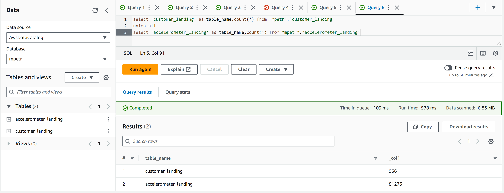

# Project: STEDI Human Balance Analytics

## Brief introduction
The STEDI Team has been hard at work developing a hardware STEDI Step Trainer that:

- trains the user to do a STEDI balance exercise;
- and has sensors on the device that collect data to train a machine-learning algorithm to detect steps;
- has a companion mobile app that collects customer data and interacts with the device sensors.
STEDI has heard from millions of early adopters who are willing to purchase the STEDI Step Trainers and use them.

Several customers have already received their Step Trainers, installed the mobile application, and begun using them together to test their balance. The Step Trainer is just a motion sensor that records the distance of the object detected. The app uses a mobile phone accelerometer to detect motion in the X, Y, and Z directions.

The STEDI team wants to use the motion sensor data to train a machine learning model to detect steps accurately in real-time. Privacy will be a primary consideration in deciding what data can be used.

Some of the early adopters have agreed to share their data for research purposes. **Only these customers’ Step Trainer and accelerometer data should be used in the training data for the machine learning model.**

# Project Solution

## Landing Zone

_**Glue Tables:**_ 
* [customer_landing.sql](./scrips/customer_landing.sql)
* [accelerometer_landing.sql](./scrips/accelerometer_landing.sql)

 ***customer_landing table:***_

    

 ***accelerometer_landing` table:***_ 

    

 ***record count check for each landing zone table:***_ 

    
